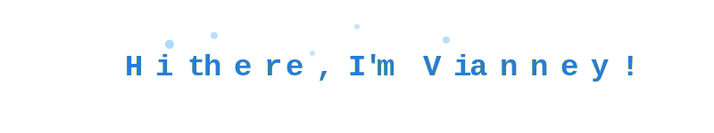

<p align="center">
  
</p>


<!---

A modifier l'animation pour le hello (en cours)

-->
## 🗨️ About me

I’m a software engineer working in France’s growing tech industry. I specialize in Python and use it across web development, data engineering, and AI.*

```
const thai = {
  code: [Javascript, Python, HTML, CSS],
  framework: [Pandas],
  techCommunities: {
                        coorganizer: "AfroPython",
                        speaker: "Latinity",
                        mentor: "EducaTRANSforma"
                      },
 challenge: "I am doing the #100DaysOfCode challenge focused on react and typescript"
}
```

---

## 🚀 My projects 

*insert projects and add a description*

<!--

insert projects and add a description

-->

---

## 📊 GitHub stats


---

## 🔥 GitHub Streak


<!--

insert this : curren streak and longest streak ✅

insert buttons / badges ✅

+ Inclure le badge JavaScript ✅

rajouter les icones, inclure les frameworks (j'ai plus tous les noms en tete) ✅

-->

[](https://developer.mozilla.org/fr/docs/Web/JavaScript)
[](https://www.python.org/)
[](https://code.visualstudio.com/)
[](https://developer.mozilla.org/fr/docs/Web)
[](https://pandas.pydata.org/)
[](https://www.postgresql.org/)
[](https://github.com/)


## 📞 Contact

<p align="left">
  <a href="mailto:vianney.mixtur@outlook.fr">
    <span style="color:#8A2BE2; font-size:22px; align=center">@</span>
    <span>&nbsp;&nbsp;vianney.mixtur@outlook.fr</span>
  </a>
</p>

<p align="left">
  <a href="https://www.linkedin.com/in/vianney-mixtur-pro/">
    
    <span>&nbsp;&nbsp;vianney-mixtur-pro</span>
  </a>
</p>

<p align="left">
  <a href="https://medium.com/@vianney.mixtur_39698">
    
    <span>&nbsp;&nbsp;@vianney.mixtur_39698</span>
  </a>
</p>


<!---
Aligner les fives logos avec le texte (quasi fait)

rajouter un lien vers le medium et malt 
mettre les fives en logo ✅
-->